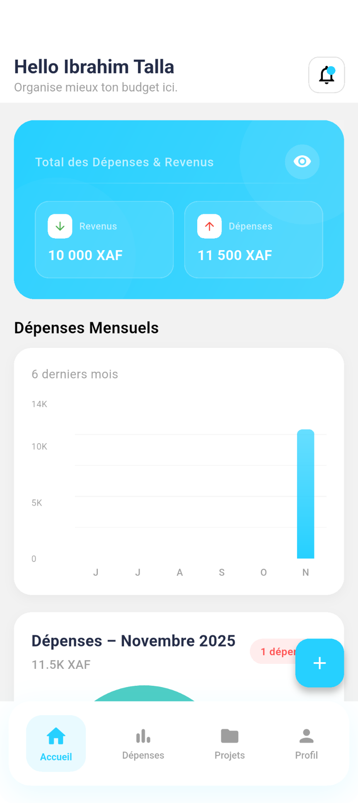
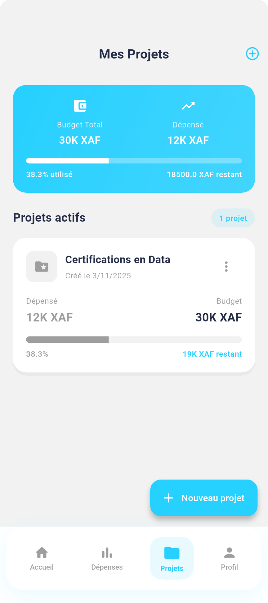
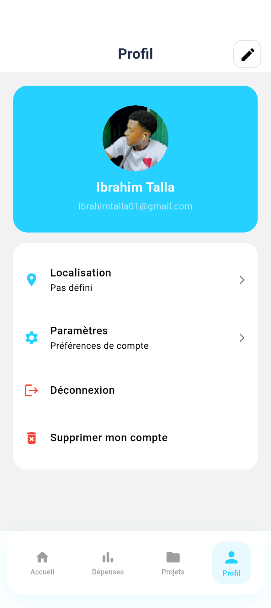

# BudgetFlow

**BudgetFlow** est une application mobile moderne développée avec **Flutter** et **Firebase**, conçue pour aider les utilisateurs à **gérer efficacement leurs finances personnelles**.  
Elle permet de suivre ses dépenses, organiser son budget et visualiser ses statistiques financières à travers une interface fluide et élégante.


## Fonctionnalités principales

- **Authentification sécurisée** (Email & Google Sign-In) via Firebase Auth  
- **Gestion du profil utilisateur** (nom, email, photo de profil, etc.)  
- **Ajout, modification et suppression de transactions** (revenus / dépenses)  
- **Statistiques et graphiques interactifs** pour une vue claire du budget  
- **Stockage cloud** avec **Cloud Firestore**  
- **Interface moderne et responsive** (mode clair / sombre)  
- **Expérience fluide et animations soignées**


## Stack technique

| Technologie | Description |
|--------------|-------------|
| **Flutter** | Framework principal pour le développement cross-platform |
| **Firebase Auth** | Gestion de l’authentification (email, Google, etc.) |
| **Cloud Firestore** | Base de données NoSQL pour stocker les données utilisateurs |
| **Provider** | Gestion d’état (state management) |
| **SharedPreferences** | Sauvegarde locale légère (onboarding, préférences) |
| **GoogleSignIn** | Connexion avec les comptes Google |


## Aperçu visuel *(Screenshots / UI)*

| Écran d'accueil | Tableau de bord |
|--------------------|--------------------|
|  |  |

| Projets | Profil utilisateur |
|-------------|------------------------|
|  |  |


## Installation & Configuration

### Cloner le projet
```bash
git clone https://github.com/Brahimi-Talla01/budgetflow.git
cd budgetflow
````

### Installer les dépendances

```bash
flutter pub get
```

### Configurer Firebase

1. Crée un projet sur [Firebase Console](https://console.firebase.google.com/)
2. Active **Authentication** (Email/Google)
3. Active **Cloud Firestore**
4. Télécharge ton fichier `google-services.json` et place-le dans :

   ```
   android/app/google-services.json
   ```
5. Pour iOS : télécharge `GoogleService-Info.plist` et place-le dans :

   ```
   ios/Runner/GoogleService-Info.plist
   ```

### Lancer l’application

```bash
flutter run
```

---

## Architecture simplifiée

```
lib/
├── models/
│   └── user_model.dart
├── providers/
│   └── auth_provider.dart
│   └── user_provider.dart
├── screens/
│   ├── auth/
│   ├── dashboard/
│   ├── profile/
│   └── onboarding/
├── utils/
│   └── app_colors.dart
│   └── constants.dart
└── main.dart
```


## Identité visuelle

| Élément             | Couleur   |
| ------------------- | --------- |
| **Primary**         | `#1A73E8` |
| **Background Dark** | `#0F172A` |
| **Success**         | `#10B981` |
| **Accent**          | `#0057FF` |
| **Text Secondary**  | `#6B7280` |

Un design simple, moderne et harmonieux, pensé pour la lisibilité et la clarté financière 


## 👤 Auteur

**Ibrahim Talla**
📧 [ibrahimtalla01@gmail.com](mailto:ibrahimtalla01@gmail.com)
🌐 Portfolio : [https://brahim-i.vercel.app](https://brahim-i.vercel.app) 
💬 Passionné par le développement mobile, la Data & l’IA.


## Contribution

Les contributions sont les bienvenues !
Tu peux :

* Ouvrir une *issue* pour signaler un bug
* Soumettre une *pull request* pour proposer une amélioration
* Liker le repo pour le soutenir


> *“BudgetFlow — Organise mieux ton budget, vis plus sereinement.”* 

